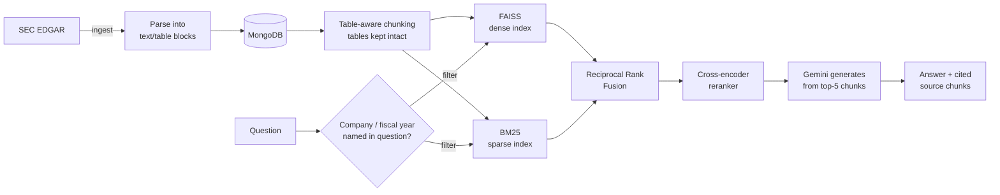
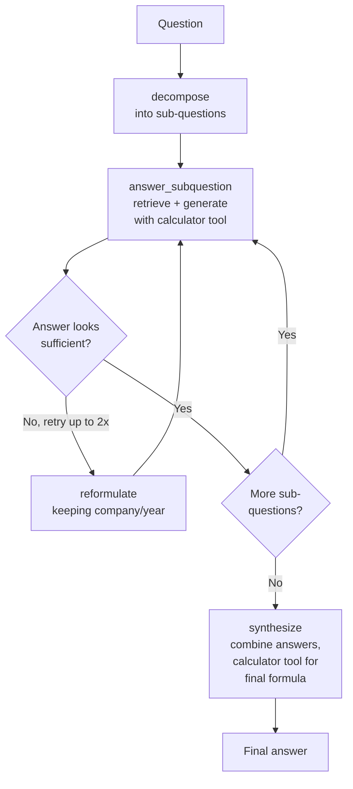

# FinDocQA

Agentic RAG system for SEC financial filings (10-K/10-Q), evaluated against
the public [FinanceBench](https://github.com/patronus-ai/financebench)
150-question benchmark. Built as a portfolio project to show real, measured
engineering work — bugs found and fixed, results measured, limitations
disclosed — not just a working demo.

**🔴 Live demo:** [findoc-assistant.streamlit.app](https://findoc-assistant.streamlit.app/)
(free-tier hosting — see [Live demo notes](#live-demo-notes) below before
judging a slow first load or a quota error as broken)

**🎥 Demo video:** _(TODO: add link once recorded — a short walkthrough
that doesn't depend on the live app's free-tier quota/uptime at the
moment someone watches)_

**Status:** All 6 weeks of the original plan are built. See
[findocqa-project-spec.md](findocqa-project-spec.md) for the full plan and
[PROGRESS.md](PROGRESS.md) / [TECHNICAL_REPORT.md](TECHNICAL_REPORT.md) /
[DATASET.md](DATASET.md) / [HOW_IT_WORKS.md](HOW_IT_WORKS.md) for detailed
write-ups — `TECHNICAL_REPORT.md` in particular is the full, honest
engineering log: every bug found, every fix tried (including ones that
didn't work and were reverted), and every number actually measured.

- **Week 1** — EDGAR ingestion, MongoDB storage, naive baseline RAG
- **Week 2** — table-aware chunking, hybrid (dense+BM25) retrieval, reranking
- **Week 3** — RAGAS evaluation harness + MLflow logging, real measured numbers
- **Week 4** — LangGraph agent: query decomposition, self-correction, real
  tool-calling (calculator), and the agent-level eval the spec calls for
- **Week 5** — CI (GitHub Actions), Dockerfile, deployment docs, Streamlit
  demo deployed live
- **Week 6** — this README, architecture diagrams, design-choice rationale,
  error analysis (below)

## Architecture

### RAG pipeline (`Simple` mode)



Company/fiscal-year filtering narrows the search *before* similarity
scoring runs, and falls back to a looser filter rather than returning
nothing if the named year isn't the one actually in the corpus for that
company — both real bugs found via live testing, not designed in upfront
(see `TECHNICAL_REPORT.md` §7).

### Agent graph (`Agent` mode — LangGraph)



Both the per-sub-question generation *and* the final synthesis step have
real calculator tool access — added after a live agent-eval run showed a
multi-step ratio question doing its final combining arithmetic as
free-text LLM math because only one of the two steps had the tool
(`TECHNICAL_REPORT.md` §8.3).

## Why these design choices

- **Hybrid retrieval (dense + BM25 + rerank), not dense-only**: dense
  embeddings miss exact keyword/figure matches; BM25 misses semantic
  phrasing differences. Fusing both and reranking the *full* fused pool
  (never truncating before reranking — an early bug) catches cases either
  retriever alone would miss.
- **LangGraph for the agent, not a single opaque agent loop**: every step
  (decompose, retrieve+generate, self-correct, synthesize) is a separate,
  independently testable function with explicit state — bugs like the
  reformulation step silently dropping company names, or synthesis lacking
  tool access, are things you can find and fix in one node without
  guessing what an opaque loop did internally.
- **RAGAS + a custom numerical-accuracy metric, not a bespoke LLM judge**:
  RAGAS's faithfulness/context-precision/context-recall are standard,
  inspectable metrics — but none of them check "is the right *number* in
  the answer," which is what FinanceBench's numeric ground truths need.
  Added a small, transparent, non-LLM regex-based check for that gap
  instead of trusting an LLM judge with something exact-match can verify.
- **Google Gemini free tier, not a paid API**: a deliberate cost
  constraint for a portfolio project — and the resulting rate-limit
  engineering (a single shared throttle every real call funnels through,
  found necessary after a real incident) is itself part of what's being
  demonstrated, not just a workaround.
- **MongoDB Atlas for both filing storage and the search-index cache**:
  already-provisioned, already-free infrastructure — reused via GridFS to
  cache the built FAISS/BM25 indexes so a fresh deployment container
  downloads a ready index (~19s) instead of rebuilding one from scratch
  (~7+ min), rather than standing up a separate object store.

## Measured results

### RAG-level (RAGAS eval, 20-question FinanceBench subset)

Same 20 questions, same config (hybrid + BM25 + reranker), before vs.
after this session's retrieval fixes (company/year filtering with
fallback, finer table chunking, wider candidate pool when filtered):

| Metric | Before | After | Change |
|---|---|---|---|
| Faithfulness | 0.912 | 0.850 | −0.062 |
| Context precision | 0.092 | 0.122 | +33% relative |
| Context recall | 0.100 | 0.167 | +67% relative |
| Numerical accuracy | 0.211 | 0.263 | +25% relative |

Full 3-config breakdown (naive baseline included) and the faithfulness
trade-off's explanation: `TECHNICAL_REPORT.md` §4 and §7.10.

### Vs. FinanceBench's own published baselines

The [FinanceBench paper](https://arxiv.org/abs/2311.11944) reports GPT-4
with **no retrieval** (full document in context) at **68% accuracy**, but
GPT-4-Turbo **with a standard RAG retrieval system** (OpenAI ada-002
embeddings) correctly answered only **~19%** of questions — the paper's
own headline finding is that retrieval, not the LLM, is the bottleneck on
this benchmark.

This project's numerical-accuracy metric (0.211–0.263, i.e. 21–26%) is
methodologically *not* identical to the paper's overall accuracy metric
(theirs is LLM-judged across all answer types including qualitative
ones; this project's is a non-LLM numeric-match check, scored only on
questions with a numeric ground truth) — so treat this as a rough,
same-ballpark comparison, not an apples-to-apples one. With that caveat:
landing near the paper's own **RAG-with-retrieval** baseline (~19%)
rather than its much higher no-retrieval baseline (68%) is consistent
with the paper's core finding, using a smaller, free-tier model
(Gemini 3.5 Flash Lite, not GPT-4/GPT-4-Turbo) and a hand-built retrieval
stack rather than a naive vector store.

### Agent-level eval (6 hand-picked "Numerical reasoning" questions)

No prior work existed to benchmark against here — this eval, and the
tool-calling it measures, didn't exist until this session (`TECHNICAL_REPORT.md`
§8):

| | Result |
|---|---|
| Completed without crashing | 6/6 |
| Calculator tool used correctly | 5/6 |
| Task completion (numerical accuracy) | 3/6 |

A real, mixed result on a small, hand-picked sample — not a claim of
general agent reliability. See §8.2–8.3 for exactly which cases failed
and why (one retrieval gap, one metric quirk, one data-retrieval issue
underneath verified-correct arithmetic).

## Tool-use example (real output, not illustrative)

```
Question: What is the 3-year average capital expenditure for 3M
          from FY2016 to FY2018?

Agent decides to call: calculate("(1.420+1.461+1.493)/3")
Tool returns: 1.4580000000000002

Final answer: "...capital spending (capital expenditures) was:
- 2016: $1.420 billion
- 2015: $1.461 billion (Note: 2015 is provided instead of 2018;
  2017 is only an expected range)
- 2014: $1.493 billion
The provided context does not contain the capital expenditure
figures for 2018... However, using the actual available figures
for 2016, 2015, and 2014, the mean value is 1.458 billion."
```

Notice the model both used the tool for the actual arithmetic *and*
honestly flagged which years' data it could and couldn't find — rather
than silently substituting or guessing.

## Error analysis (the honest part)

Full detail lives in `TECHNICAL_REPORT.md`, but the headline findings:

- **Fixed**: growing the corpus caused same-topic chunks from the wrong
  company/fiscal-year to outrank the correct one (§7); a hard company+year
  filter could return *zero* chunks for multi-year questions naming a year
  outside the corpus, worse than no filter at all (§7.9); the agent's
  retry-reformulation step silently dropped company names, undoing the
  disambiguation fix on retry (§7.7); the calculator tool existed but was
  never reachable by the agent's real execution path (§8).
- **Tested and ruled out**: swapping in a finance-tuned embedding model
  and two stronger rerankers to close the remaining precision/recall gap
  — none of 5 models tested fixed it; the finance-tuned embedding model
  actually made the target misranking worse (§7.11).
- **Still open, understood, and scoped**: a specific-figure question can
  fail when the right number sits inside a large table chunk diluted
  among unrelated line items, or when the question's wording ("capital
  expenditure") differs from the filing's exact phrasing ("purchases of
  property, plant and equipment") — neither a better chunk size nor a
  better off-the-shelf model closes this; it needs a structural fix
  (extracting table rows into labeled facts, not matching passages by
  similarity) that's out of scope for this pass (§7.4, §7.5, §7.11).
- **Deliberately not built**: autonomous EDGAR live-fetch tool-calling —
  unlike the calculator (pure computation), it has real side effects
  (mutates MongoDB, triggers a full reindex) and cost/abuse surface on a
  shared public demo (§8.1).

## Live demo notes

- **First load after inactivity**: Streamlit Community Cloud's free tier
  puts idle apps to sleep; the first visitor after a while sees "your app
  is waking up" for up to ~1-2 minutes. This is platform behavior, not
  this project's code.
- **First real question after a fresh deploy**: the search index is
  cached in MongoDB Atlas (GridFS) and downloaded (~19s) rather than
  rebuilt from scratch (~7+ min) — see `TECHNICAL_REPORT.md` §7.6.
- **Shared quota**: every visitor shares one Gemini free-tier API key
  (500 requests/day). A quota or "high demand" (503) error is a real,
  observed, expected occurrence on a public free-tier demo, not a bug —
  the UI reports both cases in plain language rather than a raw error.
- **Simple vs. Agent mode**: Simple mode does one retrieval + one
  generation call — best for a direct single-company/year lookup. It does
  *not* reliably handle comparison questions (a single unfiltered search
  across the whole corpus doesn't guarantee both companies show up in the
  top results) — that's what Agent mode's decomposition exists for.

## Setup

```bash
uv sync
cp .env.example .env   # then fill in GOOGLE_API_KEY, MONGODB_URI, SEC_EDGAR_USER_AGENT
```

You need:
- A [Google AI Studio API key](https://aistudio.google.com/apikey) (Gemini
  free tier — no card required). Note: the free tier caps at 500
  requests/day per model — see `TECHNICAL_REPORT.md` for how this project
  hit that limit twice during development and designed around it.
- A [MongoDB Atlas](https://www.mongodb.com/cloud/atlas/register) free-tier
  cluster connection string

## Pipeline

```bash
# 1. Fetch, parse, and store FinanceBench-referenced filings in MongoDB
uv run scripts/ingest.py --limit 5

# 2. Chunk + embed + build the retrieval indexes (both variants)
uv run scripts/build_index.py --variant naive
uv run scripts/build_index.py --variant table_aware

# 3. Ask a question against the pipeline
uv run scripts/ask.py "What is the FY2018 capital expenditure amount (in USD millions) for 3M?"

# 4. Ask a multi-step question via the LangGraph agent
uv run scripts/agent_ask.py "Compare 3M and Amazon's revenue growth over the last two fiscal years"

# 5. Run the RAGAS evaluation harness (naive vs. hybrid+rerank vs. hybrid-no-rerank)
uv run scripts/run_eval.py --n-questions 20

# 6. Run the agent-level eval (tool-call correctness, task completion, failure handling)
uv run scripts/eval_agent.py

# 7. Run the Streamlit demo locally
uv run streamlit run src/findocqa/ui/app.py
```

## Tests

```bash
uv run pytest
```

Runs automatically on every push/PR via GitHub Actions
(`.github/workflows/test.yml`) — no API keys needed, all unit tests.

## CI/CD

- **`test.yml`** — the full unit test suite, on every push/PR, free (no
  API calls).
- **`eval.yml`** — the real RAGAS eval, manually triggered
  (`workflow_dispatch`) rather than on every push, since Gemini's
  free-tier daily quota can't sustain a real eval run on every commit
  (see `TECHNICAL_REPORT.md` for the incident that drove this design).
  Needs `GOOGLE_API_KEY` and `MONGODB_URI` added as repo secrets under
  Settings → Secrets and variables → Actions to run.

## Docker

```bash
docker build -f deploy/docker/Dockerfile -t findocqa .
docker run --env-file .env findocqa uv run scripts/ask.py "..."
```

Containerizes the CLI pipeline above. Not build-tested locally (Docker
isn't installed in this project's dev environment) — see
`deploy/aws/DEPLOYMENT.md` for the honest status and how this would map
to an actual AWS deployment (not done — real ongoing cost, not worth it
for a portfolio project given the Streamlit Cloud deployment already
serves the same purpose for free).

## Project layout

- `src/findocqa/ingestion/` — EDGAR/FinanceBench fetching, HTML parsing
- `src/findocqa/storage/` — MongoDB (raw parsed filings + metadata)
- `src/findocqa/retrieval/` — chunking, embeddings, FAISS + BM25, hybrid
  fusion, reranking, company/fiscal-year filtering, MongoDB index cache
- `src/findocqa/generation/` — prompt + Gemini call for QA, shared rate limiter
- `src/findocqa/agent/` — LangGraph agent (decomposition, tools,
  self-correction, real function-calling)
- `src/findocqa/eval/` — RAGAS harness, custom numerical-accuracy metric,
  eval subset selection
- `src/findocqa/ui/` — Streamlit demo (deployed at the live-demo link above)
- `deploy/docker/` — Dockerfile
- `deploy/aws/` — deployment documentation
- `.github/workflows/` — CI (tests) + manually-triggered eval workflow
- `scripts/eval_agent.py` — the agent-level eval (tool-call correctness,
  task completion, failure handling)
